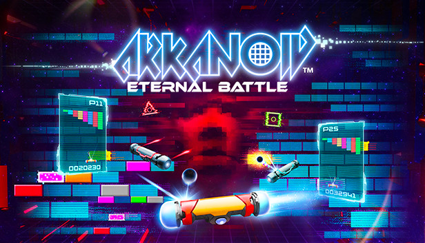

# 🎮 Arkanoid Game Project

## Project Overview

This is a modern, performance-optimized implementation of the classic Arkanoid (Brick Breaker) game built using pure JavaScript, HTML, and CSS. The project focuses on creating a smooth, responsive, and engaging gaming experience with a strong emphasis on performance and code quality.



## 🚀 Project Goals

- Implement a classic Arkanoid gameplay experience
- Achieve consistent 60 FPS performance
- Create a modular, maintainable codebase
- Provide responsive and smooth controls
- Support multiple levels with increasing difficulty

## 📦 Project Structure

```
make-your-game/
├── src/                # Source files
│   ├── assets/         # Game assets (images, sounds)
│   ├── js/             # JavaScript modules
│   ├── styles/         # CSS stylesheets
│   └── index.html      # Main game entry point
├── tests/              # Unit and performance tests
├── config/             # Build and development configurations
├── docs/               # Project documentation
└── README.md           # Project documentation
```

## 🛠 Technologies Used

- **Language**: Vanilla JavaScript
- **Build Tool**: Webpack
- **Linting**: ESLint
- **Testing**: Jest
- **Performance Monitoring**: Browser Performance API

## 🎯 Key Features

- Smooth paddle controls
- Dynamic ball physics
- Multiple brick types
- Progressive difficulty levels
- Pause menu
- Performance-optimized rendering
- Responsive design

## 🛠 Development Setup

### Prerequisites

- Node.js (v14+ recommended)
- npm or yarn

### Installation Steps

1. Clone the repository
```bash
git clone https://github.com/Youssefhajjaoui/make-your-game.git
cd arkanoid-game
```

2. Install dependencies
```bash
npm install
```

3. Start development server
```bash
npm run start
```

4. Build for production
```bash
npm run build
```

## 🧪 Running Tests

```bash
npm run test
```

## 📊 Performance Benchmarks

- **Target Frame Rate**: 60 FPS
- **Rendering**: Optimized DOM manipulation
- **Physics**: Efficient collision detection

## 🎮 Game Controls

- **Left Arrow**: Move paddle left
- **Right Arrow**: Move paddle right
- **Spacebar**: Launch ball / Start game
- **Escape**: Pause/Unpause game

## 📈 Development Roadmap

### Phase 1: Core Mechanics
- [ ] Basic game loop
- [ ] Paddle movement
- [ ] Ball physics
- [ ] Collision detection

### Phase 2: Game Systems
- [ ] Scoring system
- [ ] Lives and game over mechanics
- [ ] Level progression
- [ ] Power-ups

### Phase 3: Polish
- [ ] Sound effects
- [ ] Animations
- [ ] Menu systems
- [ ] Responsive design

## 🤝 Contributing

1. Fork the repository
2. Create your feature branch (`git checkout -b feature/AmazingFeature`)
3. Commit your changes (`git commit -m 'Add some AmazingFeature'`)
4. Push to the branch (`git push origin feature/AmazingFeature`)
5. Open a Pull Request

## 📋 Coding Standards

- Follow ESLint rules
- Write clean, modular code
- Add comments for complex logic
- Maintain performance considerations

## 🔧 Troubleshooting

- Ensure you're using a modern browser
- Check console for any performance warnings
- Verify Node.js and npm are up to date

## 📜 License

Distributed under the MIT License. See `LICENSE` for more information.

## 👥 Team

- Youssef Hajjaoui
- Ilyass-Mohamed Foukahi

Project Link: [https://github.com/Youssefhajjaoui/make-your-game](https://github.com/Youssefhajjaoui/make-your-game)

## 🙏 Acknowledgements

- Inspiration from classic Arkanoid game
- Open-source community

---

**Happy Coding!** 🎮🕹️